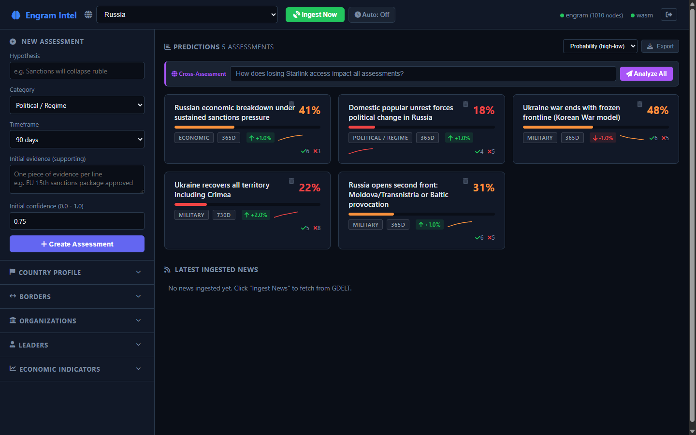
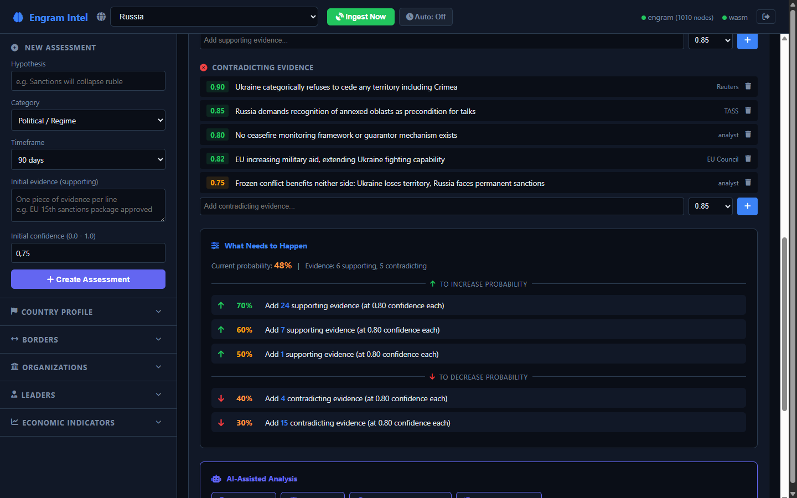
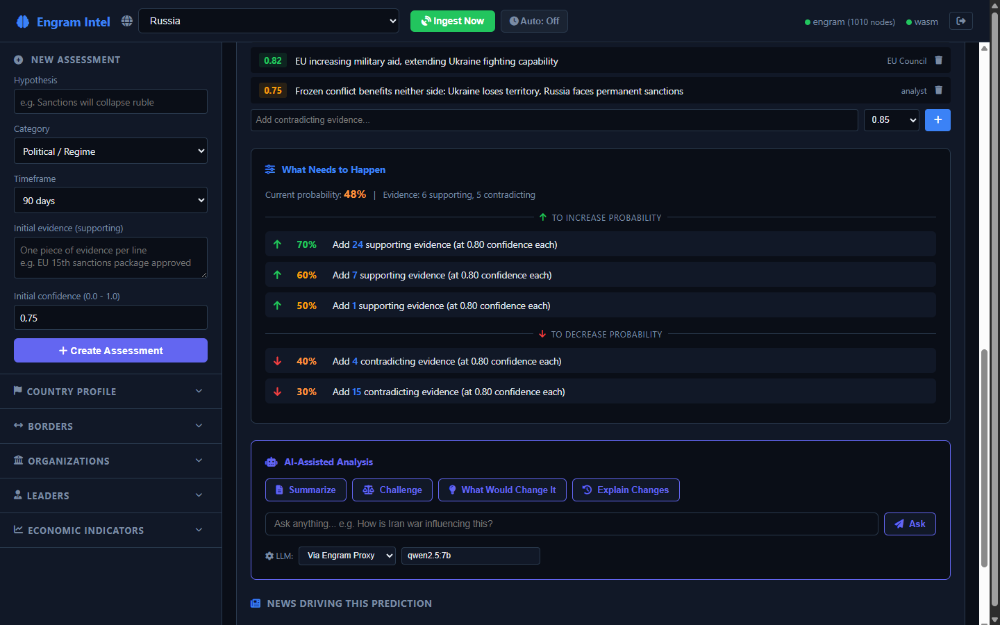

# Intel Analyst

**Geopolitical intelligence platform with Bayesian predictions, live data ingestion, and AI-assisted analysis.**

One command. Five assessments. Real data. No cloud.



## What It Does

Intel Analyst builds probabilistic intelligence assessments from live public data sources. Every prediction has traceable evidence chains, every probability is computed from weighted sources, and every claim can be challenged with contradicting evidence.

- **Bayesian probability engine** -- WASM-compiled Rust running in the browser. Probabilities shift as evidence accumulates.
- **Multi-source intelligence pipeline** -- GDELT news, Google News RSS, Wikipedia, web search (SearXNG), knowledge graph traversal
- **Cross-assessment analysis** -- "How does losing Starlink access impact ALL assessments?" with visual probability impact cards
- **Source reliability tiers** -- World Bank (0.93) vs state media (0.25). Confidence flows through every prediction.
- **AI-assisted analysis** -- Summarize, Challenge, "What Would Change It", free-form questions via local LLM



### What Needs to Happen

Every assessment shows exactly how much evidence is needed to shift the probability up or down. Not vibes -- math.



## Quick Start

```bash
docker compose up
```

Open http://localhost:8888 -- the dashboard loads with a pre-built knowledge graph (1010 nodes) and 5 demo assessments on Russia.

### Services

| Service | Port | Purpose |
|---------|------|---------|
| Dashboard | 8888 | Intelligence platform UI |
| Engram | 3030 | Knowledge graph + API |
| SearXNG | 8090 | Private web search |

### Optional: Local LLM

For AI-assisted analysis (Summarize, Challenge, What Would Change It), run [Ollama](https://ollama.com) on your host:

```bash
ollama pull qwen2.5:7b
ollama serve
```

The dashboard connects to Ollama at `localhost:11434` automatically.

## Pre-loaded Demo

The Docker image ships with:

- **1010-node knowledge graph** -- countries, borders, organizations, leaders, economic indicators, conflict data, sanctions, disputed territories
- **5 intelligence assessments:**
  - Russian economic breakdown under sustained sanctions pressure (41%)
  - Domestic popular unrest forces political change in Russia (18%)
  - Ukraine war ends with frozen frontline / Korean War model (48%)
  - Ukraine recovers all territory including Crimea (22%)
  - Russia opens second front: Moldova/Transnistria or Baltic provocation (31%)

Click "Ingest Now" to pull live news from GDELT and watch the probabilities shift.

## How Predictions Work

Each assessment has supporting and contradicting evidence, weighted by source reliability:

```
P = weighted_for * (1 - weighted_against * discount)
where discount = |against| / (|for| + |against|)
```

Sources are tiered:

| Tier | Sources | Confidence |
|------|---------|------------|
| Institutional | World Bank, UN, NATO, Wikidata | 0.90 - 0.95 |
| Quality journalism | Reuters, AP, BBC, ISW, RUSI | 0.82 - 0.88 |
| State-controlled | TASS, RT, Sputnik | 0.20 - 0.30 |

## Architecture

```
Browser (WASM + Vanilla JS)          Engram API              External
+---------------------------+    +----------------+    +------------------+
| Bayesian probability      |--->| /store         |    | GDELT News API   |
| Assessment cards          |    | /query         |    | Google News RSS  |
| Deep investigation        |--->| /ask (LLM)     |    | Wikipedia REST   |
| Cross-assessment analysis |    | /proxy/gdelt   |--->| SearXNG (local)  |
| Source citation renderer  |    | /proxy/rss     |    | Ollama LLM       |
| Knowledge accumulation    |--->| /proxy/search  |    +------------------+
+---------------------------+    | /proxy/llm     |
                                 +----------------+
```

## Powered By

Built on [**Engram**](https://github.com/dx111ge/engram) -- AI memory engine with knowledge graph, semantic search, reasoning, and learning in a single Rust binary.

## Trial

This Docker image includes a **7-day trial**. After expiration, visit [github.com/dx111ge/engram](https://github.com/dx111ge/engram) for licensing options.

## License

Proprietary. Free for personal evaluation. Commercial use requires a license.
